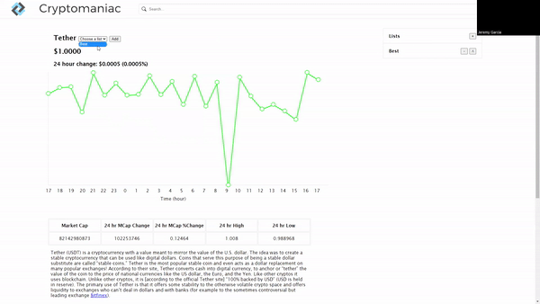

# Cryptomaniac (cryyptocurrency market viewer/tracker)

Cryptomaniac is a simple single page application that uses live crypto data from the open source API called Coingecko to allow users to view and track crypto coins. 

## Installation

Fork this repo, copy the SSH link, and type "git clone 'SSH link'" into your terminal in your desired directory.

## Usage

Cryptomaniac displays hourly stock action for the currently selected coin for the last 24 hours, current price, change/percent chage over the past 24 hours, 24 hour high, 24 hour low, market cap, description of the coin, and 24 hour change in market cap. The page opens with Bitcoin automatically selected so that you immediately see its information on the screen. 

A visitor can select a different coin by typing in the name of the coin into the searchbar at the top of the page and clicking enter. 

A visitor can also organize the coins that you want to keep track of in an editable list creator on the side of the page. Any coins that you saved into a list can also act as shortcuts to select those coins to display on the page.

The page also makes a fetch request to Coingecko every 5 minutes in order to update the 24 hour price history graph with any live updates.

## Sample GIF of Application

## Contributing

Pull requests are welcome. For major changes, please open an issue first to discuss what you would like to change.

## Roadmap

I plan on eventually adding the capability to change the interval tracking of the graphical price history of the chosen coin.

In addition, I plan on adding the capability to take a customizable date range to display on the graph.

## License

[MIT](https://choosealicense.com/licenses/mit/)